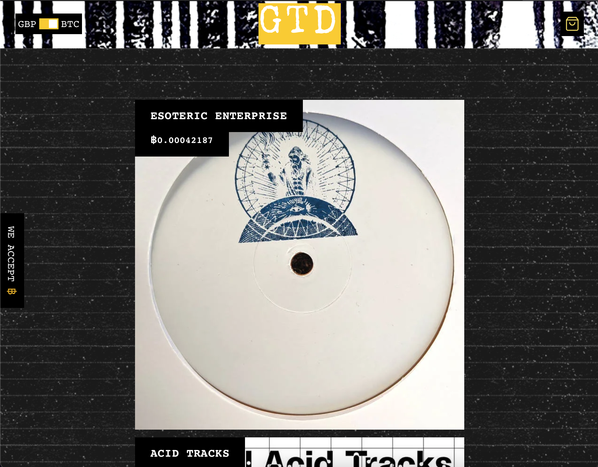

## Gated Records - Record Label E-Commerce



## Features

- Next.js Commerce Application built on top of the Shopify API.
- Added custom functionality for the client to their own custom crypto currency payment gateway. It uses a node that is run on a local server to verify transactions.
- Typescript throughout and customised versions of the Next.js commerce library.
- Mobile friendly and uses server side rendering.

## Getting Started

Clone this repo and move into the project directory.

```
$ git clone https://github.com/philsmithies/gated-recs-next-js.git
$ cd gated-recs-next-js
$ yarn
$ yarn dev
```

To run the development server:

```bash
npm run dev
# or
yarn dev
```

Open [http://localhost:3000](http://localhost:3000) with your browser to see the result.

You can start editing the page by modifying `pages/index.js`. The page auto-updates as you edit the file.
